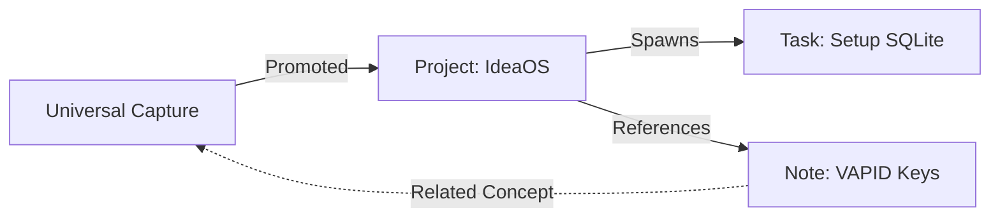

```mermaid
graph TD
    %% Main Node
    IdeaOS["🌌 IdeaOS Core (v1.0)"]
    
    %% Pillars
    AI["🤖 1. Local AI & Agentic Workflows"]
    Dev["⚡ 2. Developer Ecosystem Integrations"]
    Graph["🕸️ 3. Knowledge Graph & Visualization"]
    Deploy["🚀 4. PWA, Pi & Self-Hosting"]
    UX["✨ 5. Power-User & Advanced UX"]

    %% Connections
    IdeaOS --> AI
    IdeaOS --> Dev
    IdeaOS --> Graph
    IdeaOS --> Deploy
    IdeaOS --> UX

    %% AI Sub
    AI --> AI1["Ollama / Llama3 Auto-Tagging"]
    AI --> AI2["PRD & Architecture Generation"]
    AI --> AI3["Semantic RAG Search"]

    %% Dev Sub
    Dev --> Dev1["GitHub / Linear 2-Way Sync"]
    Dev --> Dev2["CLI Companion (idea-cli)"]
    Dev --> Dev3["Raycast / Alfred Webhooks"]

    %% Graph Sub
    Graph --> Graph1["Interactive Canvas / Node Graph"]
    Graph --> Graph2["Mermaid & Excalidraw Native"]
    Graph --> Graph3["Kanban / Sprint Toggle"]

    %% Deploy Sub
    Deploy --> Dep1["VAPID Web-Push Notifications"]
    Deploy --> Dep2["Docker & Raspberry Pi Suite"]
    Deploy --> Dep3["Automated SQLite Backups"]

    %% UX Sub
    UX --> UX1["Split-Screen / Multi-Tab"]
    UX --> UX2["Focus Mode & Pomodoro"]
    UX --> UX3["Advanced Cmd+K Macros"]
```

# 🌌 IdeaOS: The Future Vision & Expansion Roadmap

IdeaOS has successfully established its core foundation: a lightning-fast, zero-friction capture engine with an OLED aesthetic, SQLite persistence, and command-palette navigation. 

To evolve IdeaOS from a personal idea board into a **state-of-the-art Developer Operating System and Second Brain**, we can expand across five high-impact frontiers.

---

---

## 🤖 1. Local AI & Agentic Workflows
*Leveraging the flagship **Raspberry Pi 5 (8GB) + AI HAT+** NPU architecture for blazing-fast, offline-first local AI inference.*

> [!TIP]
> **Flagship Hardware Target: Raspberry Pi 5 (8GB) + AI HAT+**
> Pairing the Pi 5's 8GB RAM with the Hailo AI HAT+ (up to 26 TOPS over PCIe Gen 3) creates a formidable, 100% private edge AI server. The 8GB RAM comfortably runs quantized LLMs (Llama 3.2 1B/3B, Qwen 2.5, Phi-3.5) via Ollama, while the dedicated Hailo NPU handles real-time vector embeddings (`nomic-embed-text`) for Semantic RAG with zero CPU bottleneck.

| Feature | Description | Impact |
| :--- | :--- | :--- |
| **Auto-Tagging & Routing** | AI scans incoming Universal Inbox cards, auto-assigning project tags, priority levels, and estimated effort. | Eliminates manual sorting fatigue. |
| **One-Click Spec Generation** | Expand a single-sentence idea into a fully structured markdown PRD, system architecture outline, or task breakdown inside the Deep-Note workspace. | Drastically reduces activation energy for new projects. |
| **Semantic RAG Search** | Embeddings-based search via `Cmd + K` that finds conceptually related past ideas, duplicate thoughts, or relevant code snippets. | Prevents lost knowledge and connects dots. |
| **Rubber Duck Copilot** | A contextual chat assistant that has full access to your SQLite database to help brainstorm, debug, or challenge your architectural plans. | Provides an instant, intelligent sounding board. |

---

## ⚡ 2. Developer Ecosystem Integrations
*Meeting developers exactly where they work—in the terminal, the IDE, and issue trackers.*

> [!TIP]
> **The `idea-cli` Companion**
> Imagine typing `idea capture "refactor auth worker" --project Work --urgent` directly into your terminal while coding in Neovim/VSCode, instantly syncing to your IdeaOS SQLite backend.

* **GitHub / Linear Two-Way Sync**: Convert an IdeaOS card into a GitHub Issue, PR draft, or Linear ticket. Track external issue statuses directly within your Daily Tasks feed.
* **Raycast / Alfred / Webhook Ingestion**: Dedicated REST endpoints enabling instant quick-capture from global OS shortcuts, browser extensions, or iOS Shortcuts.
* **Live Code Sandbox & Snippet Library**: Upgrade markdown code blocks with Monaco/CodeMirror integration, multi-language syntax highlighting, one-click copy, and live scratchpad execution.

---

## 🕸️ 3. Knowledge Graph & Advanced Visualization
*Transforming flat lists into an interconnected, multi-dimensional second brain.*

* **Interactive Canvas / Node Graph**: A visual, drag-and-drop network graph (similar to Obsidian or Roam) displaying how ideas, projects, and daily tasks link together.
* **Native Mermaid.js & Excalidraw**: Embed live, editable architecture diagrams, user flows, and whiteboard sketches directly inside your project cards.
* **Multi-View Toggle (Kanban / Gantt)**: Switch any Project Board from a Masonry Idea Grid into a structured Kanban board (Backlog → In Progress → Done) or a" Timeline/Gantt roadmap.

---

## 🚀 4. PWA, Raspberry Pi & Self-Hosting Architecture
*Achieving total data ownership, persistent uptime, and seamless cross-device synchronization.*

> [!IMPORTANT]
> **Flagship Self-Hosting Architecture**
> IdeaOS is optimized for the **Raspberry Pi 5 (8GB) + AI HAT+**. This configuration provides the perfect synergy of low-power 24/7 uptime, massive AI inference capabilities, and lightning-fast SQLite WAL persistence over PCIe/NVMe.

* **VAPID Web-Push Notifications**: Service worker integration enabling real-time desktop and mobile push notifications for scheduled reminders and time-sensitive idea prompts.
* **Turnkey Docker / Pi Deployment Suite**: A production-ready `docker-compose.yml`, automated environment setup script, and Nginx reverse proxy configuration for 1-click self-hosting.
* **Automated SQLite Backups & S3 Sync**: Scheduled cron jobs that safely backup the WAL-mode SQLite database to AWS S3, a private GitHub repository, or automated JSON/Markdown exports.

---

## ✨ 5. Power-User UX & Workspace Polish
*Refining the OLED aesthetic into an uncompromising, hyper-productive environment.*

* **Split-Screen & Multi-Tab Workspaces**: Open a Project Board on the left while keeping your Daily Tasks or a scratchpad pinned on the right.
* **Deep Work / Focus Mode**: A dedicated, distraction-free Pomodoro timer view that dims the entire interface except for your current active task or idea card.
* **Advanced `Cmd + K` Macros**: Bulk-select cards, trigger custom multi-step actions (e.g., "Archive completed tasks + export project summary"), and assign custom keyboard shortcuts.

---

## 🎯 Recommended Next Steps

Here are three distinct pathways we can take for our immediate next pairing session:

1. **The Infrastructure Route**: Build the **VAPID Web-Push Notification system** and prepare the **Docker/Raspberry Pi deployment suite**.
2. **The AI & Power-User Route**: Integrate **Ollama/Local AI** for auto-tagging/spec generation, or build the **`idea-cli` terminal companion**.
3. **The Visual Route**: Implement **Kanban/Timeline views** for projects and integrate **Mermaid.js/Excalidraw** rendering in the Deep-Note workspace.
